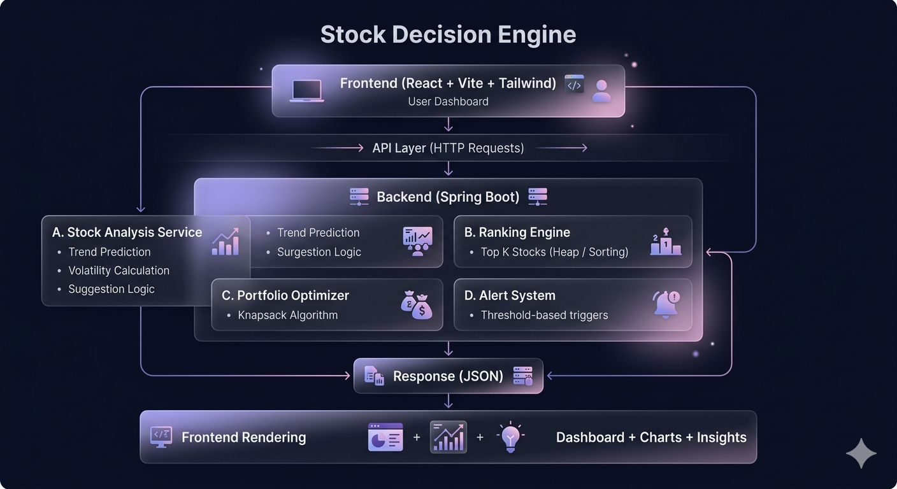

# Stock Decision Engine

A full-stack stock analysis dashboard that combines algorithmic decision-making with an interactive, modern UI to simulate real-time market insights.

---

## Overview

Stock Decision Engine is designed to demonstrate how core Data Structures and Algorithms can be applied to real-world financial systems.

The platform provides a structured dashboard where users can:

* Analyze stock behavior dynamically
* Identify top-performing stocks
* Optimize portfolios under budget constraints
* Interpret actionable insights through a clean interface

---

## System Architecture



The system follows a layered architecture:

* **Frontend (React)** handles user interaction and visualization
* **Backend (Spring Boot)** processes logic and algorithms
* **Algorithm Layer** powers decision-making (ranking, optimization, analysis)
* **API Layer** connects frontend and backend via REST endpoints

---

## Features

### Live Stock Insight

* Dynamic price updates (simulated real-time)
* Trend detection: **UP / DOWN / SIDEWAYS**
* Volatility measurement
* Actionable suggestion: **BUY / SELL / HOLD**

---

### Top K Stock Selection

* User inputs value of K
* System returns top-performing stocks
* Implemented using efficient ranking logic (Heap / Sorting)

---

### Portfolio Optimization

* Budget-based stock selection
* Maximizes expected return
* Uses **Knapsack Algorithm**

---

### Dynamic Chart

* Moving line chart for price visualization
* Updates at regular intervals
* Enhances real-time experience

---

### Alerts & Signals

* Threshold-based alerts
* Decision-focused outputs

---

## Tech Stack

### Frontend

* React (Vite)
* Tailwind CSS (Glassmorphism UI)
* Recharts

### Backend

* Java
* Spring Boot

---

## Algorithms Used

* **Heap / Sorting** -> Top K stock selection
* **Knapsack Algorithm** -> Portfolio optimization
* **Sliding Window** -> Volatility calculation
* **Trend Analysis** -> Price movement prediction

---

## Project Structure

```
backend/
 ├── controller/
 ├── service/
 ├── model/
 ├── algorithms/
 └── config/

frontend/
 ├── components/
 ├── pages/
 └── App.jsx
```

---

## API Endpoints

### Get Stock Insight

GET /api/stocks/{symbol}

Returns:

* price
* trend
* volatility
* suggestion

---

### Optimize Portfolio

POST /api/portfolio/optimize

Request:

```
{
  "budget": 500,
  "topK": 10
}
```

Response:

* selected stocks
* total cost
* expected return

---

## Setup Instructions

### Backend

```
cd backend
./gradlew bootRun
```

Runs on: http://localhost:8080

---

### Frontend

```
cd frontend
npm install
npm run dev
```

Runs on: http://localhost:5173

---

## Key Highlights

* Practical application of DSA in a real-world scenario
* Clean modular backend architecture
* Interactive and user-friendly dashboard
* Simulated real-time data for better demonstration
* Balanced focus on logic and UI

---

## Future Scope

* Integration with real-time stock APIs
* Advanced predictive models
* User authentication & portfolio history
* Deployment (AWS / Vercel)

---

## Author

Trisha Dabral

---

## License

This project is intended for educational purposes.
